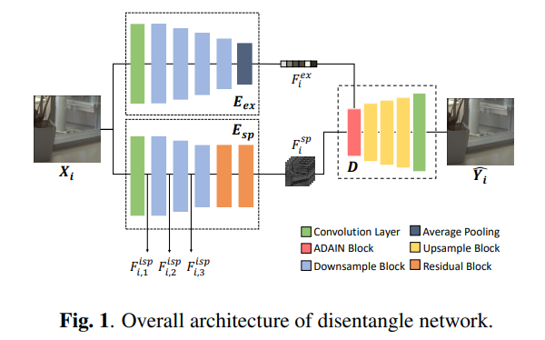
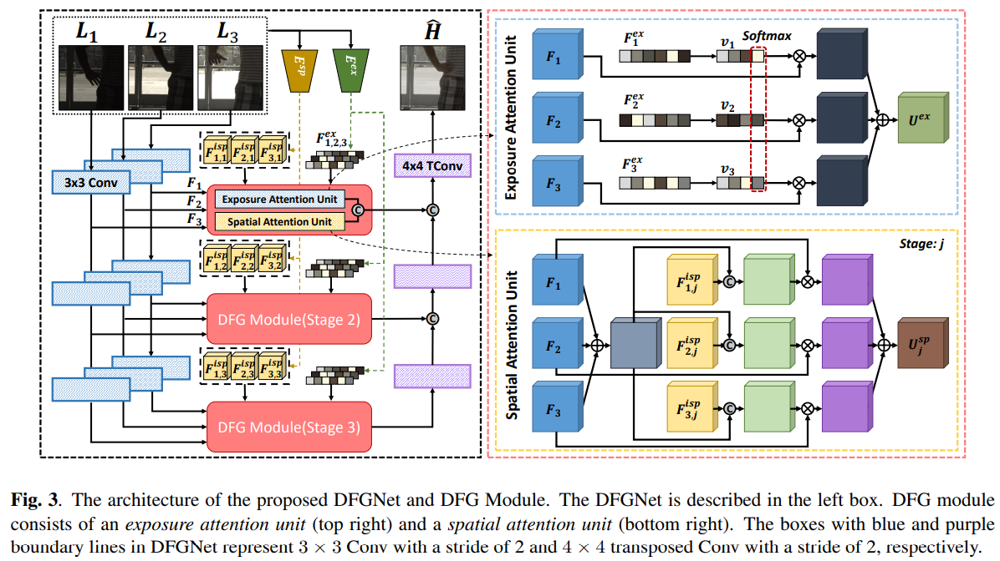
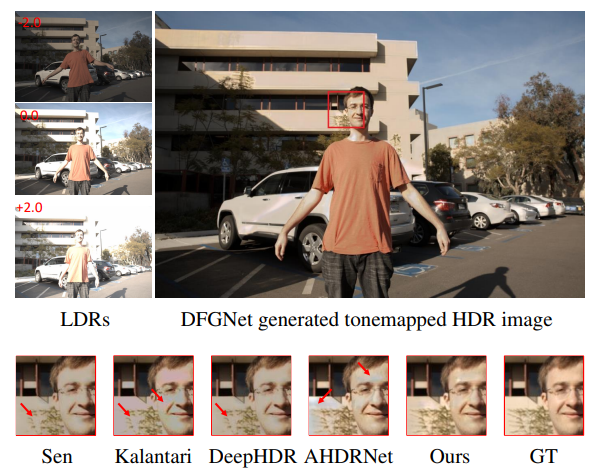

# DFGNet
# DISENTANGLED FEATURE-GUIDED MULTI-EXPOSURE HIGH DYNAMIC RANGE IMAGING (ICASSP 2022) [[PDF](https://ispl.snu.ac.kr)]

Keuntek Lee, Yeong Il Jang and Nam Ik Cho

## Environments
- Ubuntu 18.04
- Pytorch 1.10.1
- CUDA 10.2
- CuDNN 7.6.5
- Python 3.8.3

## Abstract (DFGNet)

Multi-exposure high dynamic range (HDR) imaging aims to generate an HDR image from multiple differently exposed low dynamic range (LDR) images. It is a challenging task due to two major problems: (1) there are usually misalignments among the input LDR images, and (2) LDR images often have incomplete information due to under-/over-exposure. In this paper, we propose a disentangled feature-guided HDR network (DFGNet) to alleviate the above-stated problems. Specifically, we first extract and disentangle exposure features and spatial features of input LDR images. Then, we process these features through the proposed DFG modules, which produce a high-quality HDR image. Experiments show that the proposed DFGNet achieves outstanding performance on a benchmark dataset.
<br><br>

### <u>Disentangle Network Architecture</u>

<p align="center"></p>

### <u>DFG Network Architecture</u>

<p align="center"></p>

## Experimental Results


<p align="center"></p>


### Test
#### Pre-trained Weights
[[Drive](https://drive.google.com/drive/folders/0ABwxd2RMvZ88Uk9PVA)]
[Options]
```
python test.py
```

## Citation
```
@inproceedings{lee2022disentangled,
  title={Disentangled Feature-Guided Multi-Exposure High Dynamic Range Imaging},
  author={Lee, Keuntek and Jang, Yeong Il and Cho, Nam Ik},
  booktitle={ICASSP 2022-2022 IEEE International Conference on Acoustics, Speech and Signal Processing (ICASSP)},
  pages={2465--2469},
  year={2022},
  organization={IEEE}
}
```
